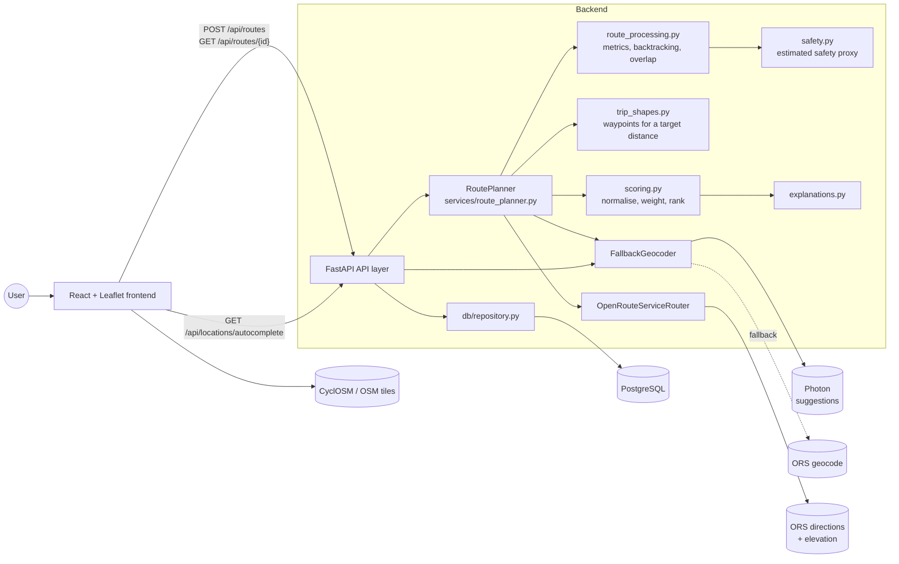
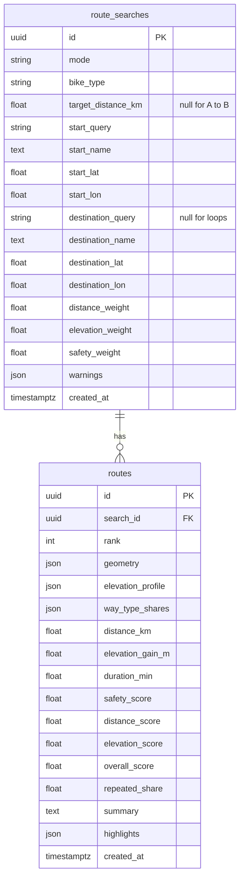

# Architecture

## Overview



OpenRouteService provides routing and elevation (returned inside the route geometry), and needs a
key. A free key allows about **200 routing calls and 100 geocoding calls a day**, which shapes two
decisions below.

### Geocoding: Photon first, OpenRouteService as fallback

Suggestions fire as the rider types, so on ORS alone one evening of use exhausted the daily
geocoding quota. Suggestions therefore come from **Photon** (`services/photon.py`), Komoot's
OpenStreetMap geocoder: no key, no quota, and built for partial type-ahead input. It also handles
mixed queries better — "icon 330 phillip" finds the building on Phillip Street, where ORS matched a
lounge in Iowa. Photon returns one result per business, so results sharing a street address are
collapsed into a single suggestion for that address.

`FallbackGeocoder` (`services/geocoding.py`) uses ORS only when Photon cannot answer:

- **Suggestions** fall back on a service failure, but *not* on an empty result, so typos never
  spend ORS quota.
- **Full lookups** of free text (rare, since the UI sends coordinates) also fall back when Photon
  finds nothing.

Within ORS, `/geocode/autocomplete` is tried first; `/geocode/search` is used when autocomplete
finds nothing (house numbers missing from the data) or its quota is spent, since the two endpoints
have separate quotas. Search weighs the focus point lightly, so its results are re-ordered by
distance from it. A spent quota (`403 "Quota exceeded"`) is reported as such, not as a rejected key.

Every lookup is ranked around a focus point — the visible map centre — which is what makes
"Waterloo" resolve to Ontario rather than Iowa.

## Request lifecycle: `POST /api/routes`

1. **Validation** (`schemas/route.py`): Pydantic checks the fields each mode needs. Loops and
   distance goals need a target distance of 2–150 km; distance goals and A → B need a destination.
   It also checks coordinates and preference weights. Invalid input returns `422 invalid_request`
   before any external call.
2. **Locations**: a location picked from autocomplete arrives with coordinates and is used as-is.
   Free text is geocoded with Photon, falling back to ORS.
3. **Trip checks** (`RoutePlanner._validate`): for example, a distance goal whose finish is further
   away than the target allows returns `422 invalid_trip`.
4. **Candidates** by mode:
   - **A → B**: one ORS request with up to 3 alternative routes.
   - **Loop / distance goal**: 4 directions are tried concurrently, at most 4 requests at a time.
     Each direction gets waypoints from `trip_shapes.solve_waypoints`, is routed, and gets one more
     attempt if it misses the target by more than 8% (see below).
5. **Provider-neutral conversion** (`services/routing.py`): the ORS payload is validated with
   private Pydantic models. The encoded polyline, which includes elevation, is decoded, and way-type
   codes are mapped to names. Nothing after this point depends on ORS.
6. **Metrics** (`services/route_processing.py`): distance, duration, elevation gain and profile,
   way-type shares, estimated safety, and `repeated_share` (backtracking).
7. **Filtering** (`select_distinct_routes`): drops rides that double back more than 40% when
   alternatives exist, and rides that share over 80% of their ground with a better candidate.
8. **Scoring and ranking** (`services/scoring.py`) with explanation text.
9. **Persistence** (`db/repository.py`): the search and its routes are saved in one transaction.
   The response is built from the saved rows.

## Layering

| Layer | Location | Responsibility |
| --- | --- | --- |
| API | `app/api/` | HTTP concerns only: routing, dependency wiring, error-to-JSON mapping |
| Schemas | `app/schemas/` | Request validation and response shapes |
| Domain | `app/domain.py` | Plain dataclasses and enums shared by services (no framework imports) |
| Services | `app/services/` | External API clients and pure business logic |
| Persistence | `app/db/` | SQLAlchemy models and repository functions |
| Core | `app/core/` | Settings and domain exceptions |

External clients sit behind small `Protocol`s (`Geocoder`, `Router`). To swap providers, write a
class that returns the same domain types and change `api/dependencies.py`.

## Algorithms

### Waypoints for a target distance (`services/trip_shapes.py`)

Routing engines connect waypoints, so target-distance rides are built by choosing waypoints:

- **Shape.** A circle passes through the start, with its centre pushed out in a compass direction
  (the *bearing*). Up to 4 via points are spaced along the circle, and the ride ends at the finish.
  The finish is the start again for loops.
- **Direction.** The ride travels from the start to the point on the circle nearest the finish,
  always passing the far side of the circle. Clockwise is used whenever that works, which gives
  mostly right turns in right-hand-traffic countries.
- **Size.** The radius is found by bisection so the straight-line path
  (start → via points → finish) equals `target / road_factor`. Passing the far side makes that
  length grow steadily with the radius, so bisection is reliable.
- **Calibration.** The first attempt assumes roads are 1.3× longer than straight lines. If the
  routed ride is more than 8% off target, the ratio actually observed for that direction replaces
  the guess and the ride is routed again. The closest attempt is kept.
- **Snapping.** Via points may fall in a field or lake. They are sent with an unlimited snap radius
  (`radiuses: -1`) so ORS moves them to the nearest road or path. Start and finish may snap up to
  1 km.
- **Directions tried.** Loops try north, east, south, and west. Distance goals try directions
  aligned with the start → finish axis.

### Backtracking and overlap (`services/route_processing.py`)

Routes are resampled every 25 m onto a grid of roughly 30 m cells.

- **`repeated_share`**: the fraction of samples in a cell first visited at least 300 m earlier in
  the ride. A clean loop is about 0, and a pure out-and-back is about 0.5.
- **Overlap** between two routes: the share of the smaller route's cells that the other route also
  covers. It is used to remove near-duplicates.

### Elevation gain

Elevation gain is the cumulative sum of **positive** changes between consecutive points, not
`max - min`. A hysteresis threshold (default 3 m) ignores DEM jitter:

- A reference elevation tracks the lowest point since the last counted climb.
- Any descent lowers the reference.
- A climb is counted once the elevation is at least the threshold above the reference.

With a threshold of 0 this equals the plain sum of positive differences, and the tests check that.

### Component scores (0–100, higher is better)

| Component | Formula | Why |
| --- | --- | --- |
| Distance (with target) | `100 × (1 − |d / target − 1| / 0.3)`, clamped | Training rides care about hitting the distance, not being short. |
| Distance (A → B) | `100 × (1 − (d / d_shortest − 1) / 0.5)`, clamped | What matters is the detour compared with the alternatives. |
| Elevation | `100 × (1 − (gain_m / km) / 25)`, clamped | Absolute climb density, so similar flat routes aren't spread to 0 and 100. |
| Safety | Distance-weighted average of per-way-type ratings | See below. |

### Overall score

`overall = Σ wᵢ·scoreᵢ / Σ wᵢ` over the available components, with the user's weights normalised
to sum to 1.

If a factor is missing for **any** candidate, it is dropped for **all** candidates and the response
carries a warning.

Ties are broken by closeness to the target, or by shorter distance when there is no target.

### Estimated safety (a proxy)

ORS reports how many metres of a route use each way type. Each way type has a fixed rating
(`services/safety.py`): cycleway 100, path 85, residential street 70, … major road 15. The safety
score is the distance-weighted average of those ratings.

It is labelled **estimated** everywhere. It knows nothing about traffic volume, speed limits, or
collision data. If more than half of a route has unknown way types, the score is `null`.

## Error handling

Domain exceptions (`core/errors.py`) carry an HTTP status and a stable error `code`.
`api/errors.py` turns them into `{"error": {"code", "message"}}`.

| Situation | Status | Code |
| --- | --- | --- |
| Invalid / missing request fields | 422 | `invalid_request` |
| Trip doesn't make sense (e.g. finish further than the target distance) | 422 | `invalid_trip` |
| Location not found | 422 | `location_not_found` |
| No route (empty result, unroutable point, no direction worked) | 404 | `no_route_found` |
| Upstream timeout, network error, 5xx, malformed payload, rejected key | 502 | `external_service_error` |
| Upstream rate limit (429) | 503 | `rate_limited` |
| Upstream daily quota used up (403 "Quota exceeded") | 503 | `quota_exceeded` |
| `ORS_API_KEY` not set | 503 | `service_not_configured` |
| Database failure | 503 | `database_error` |
| Too many requests from one client | 429 | `too_many_requests` (with `Retry-After`) |
| Unexpected exception | 500 | `internal_error` (details only in logs) |

### Rate limiting

A deployment's OpenRouteService key is shared by everyone who finds the URL, and one
target-distance search costs up to 8 of roughly 2,000 daily routing calls, so the public endpoints
cap how much one client can spend.

Counters live in the database (`rate_limit_windows`), not in memory: serverless instances share no
state, so an in-process limiter would give each instance its own allowance. Each row is one client,
one endpoint, and one fixed window - a burst at a window boundary is acceptable for abuse
protection, and fixed windows keep this to a single small row rather than a log of timestamps.
Searching and typing have separate budgets, since autocomplete fires every few keystrokes but costs
far less. Rows expire and are cleaned up as windows pass.

Bookkeeping failures are logged and allowed through: protecting a quota must never be the reason a
working request fails.

## Deployment

The live site is one Vercel project with two services (`vercel.json`): the Vite frontend and the
FastAPI backend as a Python function, sharing a domain. `/api/*` routes to the backend with the
original path preserved, so the API routes are unchanged; everything else serves the frontend.

Two differences from running a long-lived server, both configuration rather than code:

- **Connections**: serverless invocations cannot reuse a pool, so the engine uses `NullPool` and
  connects through the database's own pooled endpoint. Hosted URLs carry libpq parameters such as
  `sslmode` that asyncpg rejects, so they are translated into connect arguments.
- **Schema**: `CREATE_TABLES_ON_STARTUP=false` keeps cold starts from doing schema work;
  `scripts/init_db.py` is run once per environment instead.

## Data model



Geometry is stored as JSON rather than PostGIS geometry because the app never runs spatial queries.
Tables are created at startup with `create_all`. There are no migrations yet, so after schema
changes, recreate the database (`docker compose down -v`).

## Frontend

```
src/
  pages/PlannerPage.tsx      page layout, composes everything
  hooks/useRoutePlanner.ts   request state, cancellation, selected route
  services/api.ts            fetch wrapper → typed results / ApiError, autocomplete
  components/                SearchForm (trip type, distance, bike), LocationAutocomplete,
                             PreferenceSlider, RouteMap, RouteList, RouteCard, RouteDetails,
                             ScoreBreakdown, ElevationProfile, WayTypeBreakdown, StatusMessage
  utils/                     formatting and colours (unit-tested with Vitest)
  types/route.ts             mirrors the backend response schema
```

Autocomplete waits for 3 characters, debounces for 300 ms, cancels stale requests, and supports
keyboard navigation. Suggestions are biased towards the map centre, which the map reports as it
moves; the app asks for the rider's position on load to centre it. Destination suggestions prefer
the chosen start when there is one, since it is a sharper reference than the map centre.

In development, Vite proxies `/api` to `localhost:8000`. In Docker, nginx serves the built bundle and
proxies `/api` to the `backend` service.
